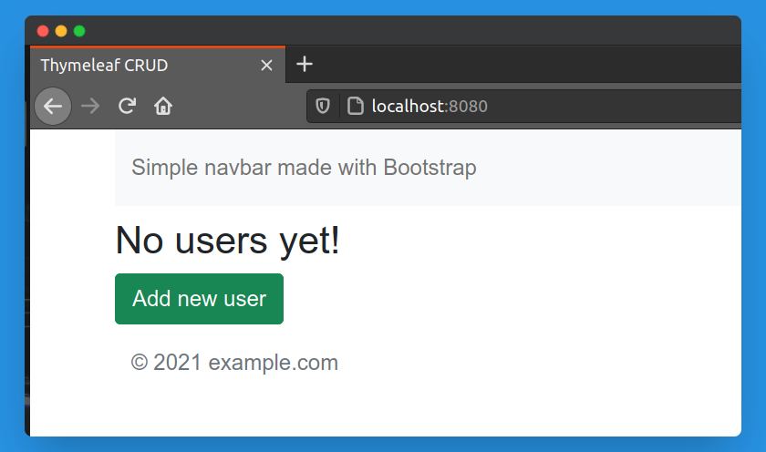
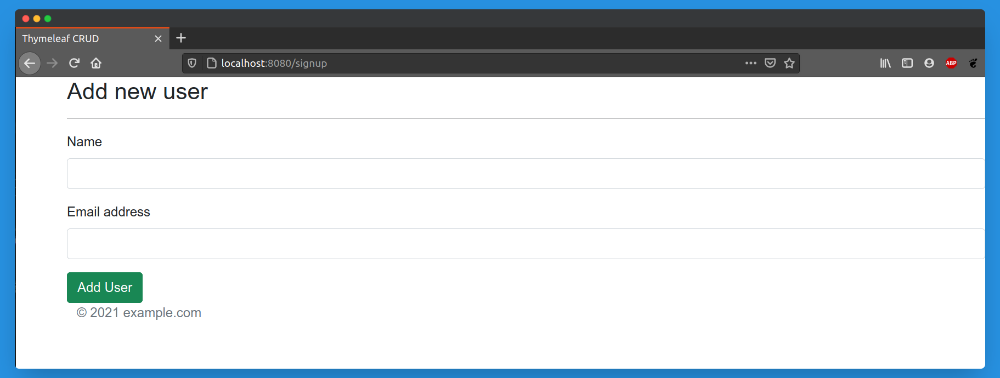
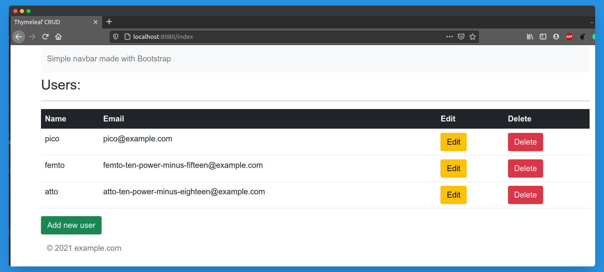
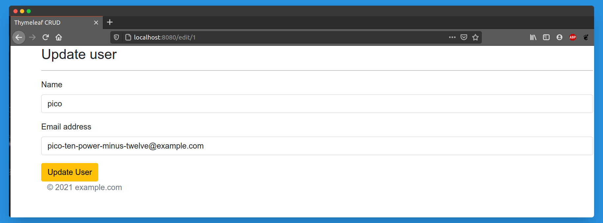

# thymeleaf-CRUD
Simple spring boot application to understand thymeleaf template engine.

## Application Output

### Initial state.

### Add new user.

### After adding few users.

### Update user.

The **Edit** and **Delete** buttons just work fine. ;)

Pay special attention to how the title of the application is being read from **i18n** properties file.

Thanks!
